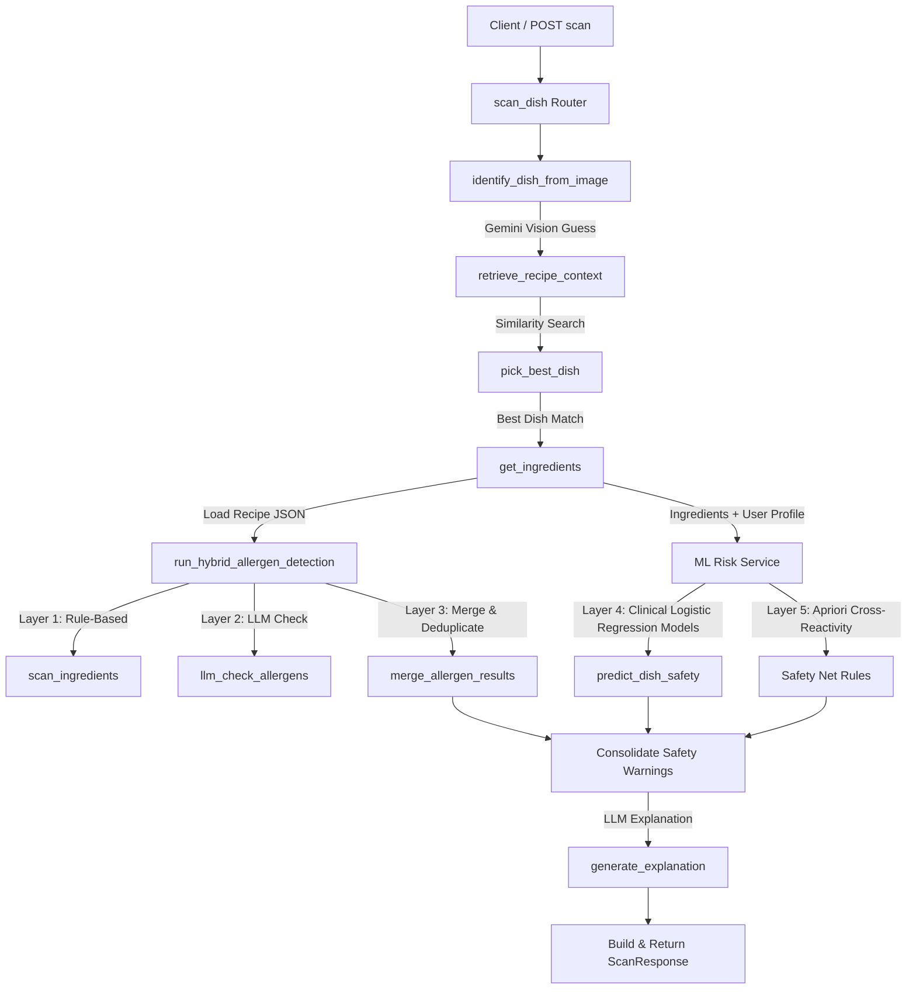

# Code Walkthrough: AI-Based Food Allergen Detection System

This document provides a complete guide to every function, notebook, and module in the project. The system has evolved from a simple rule-based and LLM-based checker into a comprehensive, personalized **Unified Intelligence Engine** that leverages deep machine learning and Apriori association rules.

---

## 🗺️ High-Level System Flow

---

## 1. Machine Learning & Data Pipeline (`ml_model/`)

The machine learning pipeline predicts clinical risk for specific allergens based on a user's demographic and medical profile.

### `notebooks/preprocessing_data.ipynb`
* **Purpose**: Cleans raw survey data to prepare it for model training.
* **Logic**: 
  1. Loads raw CSV data and standardizes column names.
  2. Parses free-text and categorical columns (e.g., medical conditions, dietary patterns, provinces).
  3. Binarizes allergen severity (e.g., converting text severity descriptors into numerical risk values: 0 for Safe, 1-3 for Risk).
  4. One-hot encodes all categorical variables (Blood Type, Province, Diet, Medical Conditions).
  5. Exports the cleaned, numerically encoded dataset to `data/processed/preprocessed_data.csv`.

### `notebooks/model training.ipynb` & `scripts/train_backend_models.py`
* **Purpose**: Trains an independent, optimized machine learning model for *each* identified food allergen.
* **Logic**:
  1. **Feature Selection (Spearman Correlation)**: Calculates a Spearman correlation matrix between all features (demographics, medical conditions) and the 31 food allergen targets. Features with a maximum correlation below `0.15` (statistical noise threshold) are discarded.
  2. **Model Training**: Iterates through each of the 31 allergens.
     - **Class-Weighted Logistic Regression**: Uses a `LogisticRegression` model with `class_weight='balanced'`. This approach outperforms tree-based models on sparse, highly-imbalanced survey data and maximizes recall (minimizing false negatives).
     - **Imbalance Handling**: The training script automatically skips any allergen target that has fewer than 2 positive cases in the survey data. As a result, 24 optimized allergen models are trained and serialized.
  3. **Artifact Serialization**: The trained model pipelines for the 24 validated allergens are saved to disk as `.joblib` files (e.g., `risk_model_prawns.joblib`).

### `scripts/apriory.py`
* **Purpose**: Discovers hidden association rules between food allergies (cross-reactivity).
* **Logic**: Uses the `mlxtend` library's Apriori and Association Rules algorithms on the binarized allergen dataset. It extracts rules with high confidence and lift (e.g., "If allergic to cuttlefish, highly likely allergic to crab"). These rules are hardcoded into the backend as the "Safety Net".

---

## 2. ML Risk Service (`backend/app/services/ml_risk_service.py`)

The Unified Intelligence Engine that evaluates personalized clinical risk at runtime.

### `build_feature_vector(user_profile: dict) -> pd.DataFrame`
* **Purpose**: Translates the user's saved profile into the exact 1D feature vector required by the trained Logistic Regression models.
* **Logic**: Initializes a dictionary with default values (`0.0`) for all columns identified during the feature selection phase. It then maps the `user_profile` values (like age, gender, one-hot encoded medical conditions, and blood types) into the correct columns and returns a Pandas DataFrame.

### `predict_dish_safety(user_profile: dict, detected_ingredients: list) -> dict`
* **Purpose**: The main ML evaluation function with advanced ingredient resolution.
* **Logic**: 
  1. **Advanced Ingredient Resolution (`_resolve_ingredient_key`)**: Before checking models, it rigorously normalizes ingredients using a 3-tier system:
     - *Synonym Mapping*: Maps complex phrases (e.g. "peanut butter" -> "peanuts", "coconut milk" -> "coconut") using a prioritized dictionary `INGREDIENT_SYNONYMS` to avoid false partial matches (e.g., matching "milk" in "coconut milk").
     - *Exact Match*: Checks if the ingredient name precisely matches a known model key.
     - *Substring Search*: Looks for known allergen model keys embedded within the ingredient phrase (e.g. "prawns" in "fresh jumbo prawns").
  2. **Clinical Prediction (Logistic Regression)**: For each resolved ingredient, it checks if a specific trained `.joblib` model exists. If so, it uses the user's `feature_vector` to predict the risk. It only generates a `ClinicalAlert` if the model predicts a high risk (output of `1` or a probability crossing the threshold). If the model predicts an ingredient is safe, it stays completely silent to avoid cluttering the results.
  3. **Apriori Safety Net (`_resolve_apriori_key`)**: Cross-references the resolved ingredients against the `SAFETY_RULES` dictionary using similar normalisation. If the dish contains an ingredient known to co-react with another allergen, a `SafetyNetWarning` is generated (e.g., "Contains prawns, which cross-reacts with cuttlefish/crab").
  4. Returns a consolidated `MLRiskReport` while strictly avoiding duplicate alerts for the same underlying allergen phrase.

---

## 3. Router Layer (`backend/app/routers/scan.py`)

Defines the endpoints exposed to clients (such as a Next.js or Flutter app).

### `scan_dish(image: UploadFile, user_id: int) -> ScanResponse`
* **Purpose**: `POST /api/v1/scan/` — The main orchestrator endpoint for the food scanning pipeline.
* **Logic**:
  1. **User Profile Retrieval**: Fetches the full user profile (demographics, medical conditions, saved allergens) from the SQLite DB using `user_id`.
  2. **Vision Identification**: Identifies the dish from the image via `identify_dish_from_image`.
  3. **RAG Context Retrieval**: Queries ChromaDB for recipe documents containing similar text to the vision guess via `retrieve_recipe_context`.
  4. **Recipe Lookup**: Selects the best dish name and loads ground-truth ingredients from recipe JSON files.
  5. **Hybrid Allergen Detection**: Matches ingredients against rules and verifies hidden ingredients via Gemini using `run_hybrid_allergen_detection`.
  6. **ML Risk Evaluation**: Calls `predict_dish_safety` with the user's comprehensive profile vector.
  7. **Safety Decision**: Overrides the `is_safe` boolean to `False` if *either* the rule-based checker flags a known user allergen OR the ML engine raises a clinical risk alert. Generates a dynamic warning message explaining the risks.

---

## 4. Multimodal RAG Service (`backend/app/services/rag_service.py`)

Handles image visual analysis and similarity searches to determine the correct dish.

### `identify_dish_from_image(image_bytes: bytes) -> str`
* **Purpose**: Performs Gemini Vision analysis to guess the dish name.
* **Logic**: Optimizes image bytes using PIL. Sends the image along with `VISION_PROMPT` to the `gemini-3.1-flash-lite` model to respond solely with a snake_case name of a known dish.

### `retrieve_recipe_context(dish_guess: str, top_k: int) -> list[dict]`
* **Purpose**: Queries ChromaDB using the vision-guessed dish name.
* **Logic**: Calls `similarity_search_with_relevance_scores` on the Chroma vector store. Converts the results into list dicts containing: `content` (page content) and `score` (cosine similarity score).

### `pick_best_dish(...) -> tuple[str, str]`
* **Purpose**: Decides on the final dish name and calculates a confidence score (`high`, `medium`, or `low`) based on vector similarity thresholds.

---

## 5. Hybrid Allergen Service (`backend/app/services/allergen_service.py`)

Executes the multi-layered hybrid allergen detection system.

### `llm_check_allergens(dish_name: str, ingredients: list[str], user_allergens: list[str]) -> list[dict]`
* **Purpose**: Employs an LLM to cross-examine ingredients for hidden/compound allergens (e.g. checking if "curry powder" contains mustard seeds).

### `merge_allergen_results(rule_based: list, llm_results: list, user_allergens: list) -> list[dict]`
* **Purpose**: Deduplicates allergen categories detected across different layers and tags the sources (e.g. `rule_based+llm`).

### `generate_explanation(...) -> str`
* **Purpose**: Generates a friendly, natural-language warning or safety summary to display directly to the user.

---

## 6. Data Ingestion & Indexing (Google Colab - Multimodal RAG)

Prepares and populates the vector database (`ChromaDB`) with both recipe text and images. This ingestion process is executed separately in Google Colab to leverage a T4 GPU for high-speed CLIP embeddings.

### `populate_multimodal_rag()`
* **Purpose**: Initializes the persistent Chroma DB client and populates two separate vector collections: `sri_lankan_recipes_text` and `sri_lankan_recipes_images`.
* **Models Used**:
  - **Text Embeddings**: `GoogleGeminiEmbeddingFunction` utilizing the `gemini-embedding-2-preview` model.
  - **Image Embeddings**: `CLIPModel` and `CLIPProcessor` (Hugging Face) utilizing the `openai/clip-vit-base-patch32` model (512-dimension vector).
* **Logic**: 
  1. Reads JSON recipes and formats them into text chunks (800 char size, 100 overlap) using `RecursiveCharacterTextSplitter`.
  2. Embeds text chunks and saves them into the `sri_lankan_recipes_text` collection.
  3. Processes corresponding dish images, generating vectors using the GPU-accelerated CLIP model.
  4. Saves image vectors to the `sri_lankan_recipes_images` collection inside the persistent `chroma_db/` directory.

---

## 7. Core Database Layer (`backend/app/core/database.py`)

Handles singleton instances of ChromaDB and embedding client connections to ensure efficiency.

### `get_embeddings()` & `get_chroma_client()` & `get_vectorstore()`
* **Purpose**: Instantiates and caches the Gemini embedding model client and persistent ChromaDB connections to prevent connection overhead during scans.

---

## 8. Allergen Knowledge Base (`backend/app/utils/allergen_kb.py`)

A fast, local dictionary-based matcher.

### `detect_allergens_in_ingredient(ingredient: str, user_allergens: list[str]) -> list[dict]`
* **Purpose**: Evaluates a single ingredient string against keyword rules in `ALLERGEN_KB`.
* **Logic**: Quickly matches lowercase substrings (e.g. if the ingredient contains "wheat", it triggers the "gluten" allergen). To optimize performance, it only scans categories of interest to the user if a profile is provided.

---

## 9. Backend Logging & Tracing

The backend logging has been upgraded so you can trace exactly what the AI is thinking at each step! 

Whenever an image is uploaded and processed, you can now look at your `uvicorn` terminal, and you will see a detailed, step-by-step trace of the **Multimodal Dish Identification** process. 

Here is what happens during the identification, and exactly what will be logged in your terminal:

1. **Vision Initial Guess (Gemini 3.1 Flash Lite)**: 
   The AI looks at the raw image first and makes a zero-shot guess at what Sri Lankan dish it might be.
   > 📝 *Log: `Vision model guessed dish: 'kottu_roti'`*

2. **Text RAG Retrieval (ChromaDB)**: 
   The system takes that guess and queries your text vector database, retrieving the closest matching recipe and ingredient contexts to anchor the AI in verified data.
   > 📝 *Log: `Text RAG retrieved 3 chunks for query 'kottu_roti'. Matches: ['kottu_roti', 'kottu_roti', 'chicken_kottu'`]*

3. **Image RAG Retrieval (CLIP + ChromaDB)**: 
   In parallel, the system passes the uploaded image through the CLIP neural network, converts it to a mathematical vector, and searches your image database for visually similar dish photos. It retrieves the closest visual matches and calculates how similar they are (the lower the distance, the more identical the image).
   > 📝 *Log: `Image RAG retrieved 3 matches. Visual matches: ['chicken_kottu (dist: 0.2314)', 'vegetable_kottu (dist: 0.3129)', 'string_hopper_kottu (dist: 0.4501)']`*

4. **Final Hybrid Reasoning (Gemini 3.1 Flash Lite)**: 
   The system gives the LLM all three pieces of context—its original visual guess, the text recipe matches, and the visually similar CLIP matches—and asks it to make a final, highly-confident conclusion about the dish.
   > 📝 *Log: `Final reasoning result: 'chicken_kottu' (Original Vision Guess: 'kottu_roti')`*

You can test this right now by scanning a dish on the frontend. Check your backend terminal window immediately after clicking "Scan for Allergens," and you'll see this entire four-step thought process printed out in real-time!

---

## 10. Frontend UI Integration

The Next.js frontend application provides an intuitive interface for users to scan dishes and view comprehensive safety reports.

### Allergen Reports & Expandable UI (`frontend/app/scan/page.tsx`)
* **Purpose**: Displays the results of the backend analysis, including detected ingredients, allergens, and clinical risk predictions.
* **Logic**: 
  1. **Scan Results Presentation**: Once a dish is scanned, the UI displays the identified dish name and an overall safety status.
  2. **Expandable "Read More" Component**: Contains detailed information grouped into distinct sections to avoid overwhelming the user initially.
     - **Detected Allergens**: Lists specific allergens identified in the dish by the hybrid rule-based and LLM engines. If no allergens are detected, it presents a clear "Safe" empty state with a success indicator, ensuring the user isn't left guessing.
     - **ML Risk Report**: Displays personalized clinical risk predictions and Apriori safety net warnings generated by the `ml_risk_service.py`. This ensures users receive nuanced, data-driven explanations for any flagged risks.

### User Profile Management (`frontend/app/profile/page.tsx`)
* **Purpose**: A comprehensive, modern interface for users to build and maintain their health and demographic profile.
* **Logic**: 
  1. **Profile Loading & Creation**: Users can load an existing profile using their unique ID or create a new one through an interactive, multi-step form.
  2. **Data Collection**: 
     - **Demographics**: Collects basic information (Age, Gender, Province) for statistical risk modeling.
     - **Health Profile**: Gathers medical conditions, dietary patterns, and specific health flags (like lactose intolerance or personal allergy history) used by the Logistic Regression clinical models.
     - **Allergen Selection**: Provides grouped, easy-to-select toggles for all known food allergens.
  3. **Responsive Glassmorphism UI**: Uses a premium, spacious layout with dynamic grid systems and smooth transitions to make filling out the medical form an engaging experience.